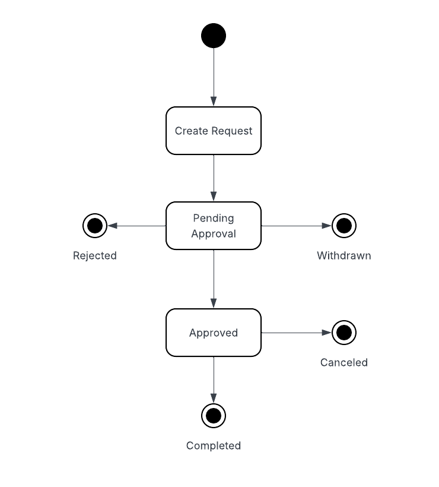
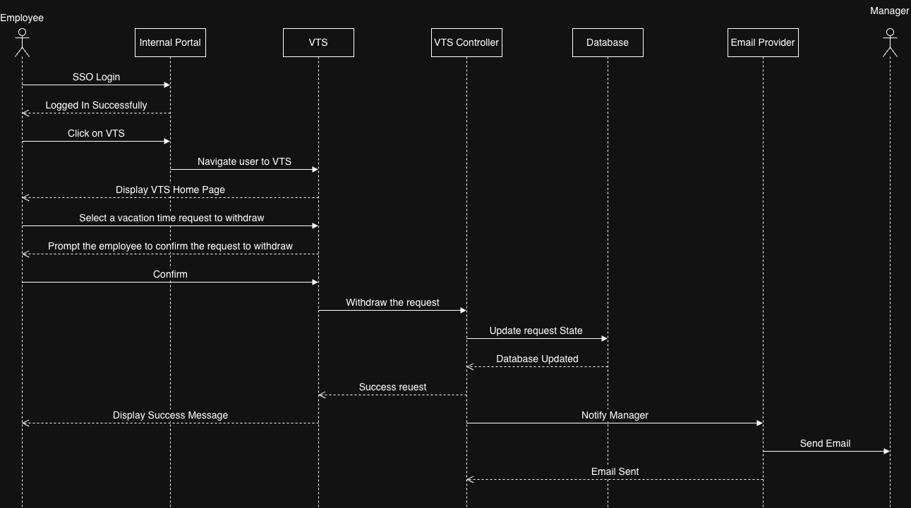
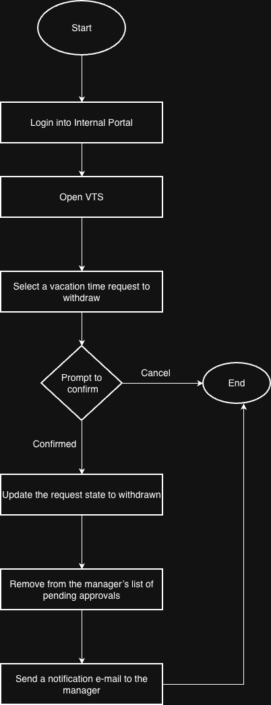
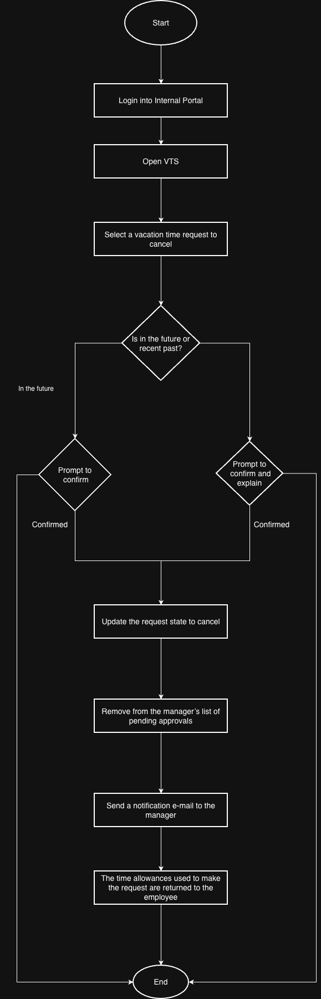
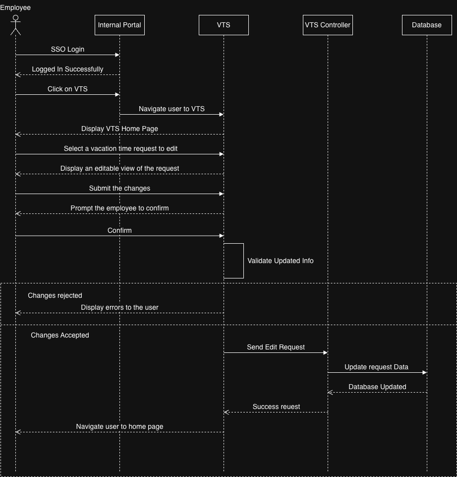

## Vacation Tracking System (VTS)


### Table of Contents

- **Domain**
- **Vision**
- **Functional Requirements**
- **Non-Functional Requirements**
- **Constraints**
- **Actors**
- **Use Case: Manage Time**
- **Data Model**
- **Diagrams**
- **Pseudocode**

### Domain

In large organizations, managing vacation time is often manual, inefficient, and error-prone. Employees typically go through multiple approval layers (manager → HR clerk → system entry), leading to delays, confusion, and wasted HR time.

### Vision

VTS enables employees to manage their own vacation time, sick leave, and personal time off without needing expert knowledge of central or local leave policies.

### Functional Requirements

- Implements a flexible, rules-based system for validating and verifying leave requests
- Supports optional manager approval
- Provides access to requests for the previous calendar year and up to 18 months ahead
- Sends email notifications for manager approvals and status changes
- Uses existing hardware and middleware
- Integrates with the intranet portal and leverages single sign-on (SSO)
- Keeps activity logs for all transactions
- Allows privileged overrides by HR/admin with audit logging
- Enables managers to directly award personal leave time (with system-set limits)

### Non-Functional Requirements

- Easy to use, intuitive, and intelligent
- Saves time and cost, especially within HR operations

### Constraints

- Use existing hardware and middleware
- Implement as part of the existing intranet portal
- Use the portal’s single sign-on mechanism
- Interface correctly with HR legacy systems for employee data

### Actors

- Employee
- Manager
- HR Clerk
- System Admin

### Use Case: Manage Time

Employees interact with VTS to:

- Submit vacation time requests
- View the status and history of their requests

### Data Model

Employee

| Attribute              | Type                                   | Description                        |
| ---------------------- | -------------------------------------- | ---------------------------------- |
| `id`                   | PK                                     | Unique ID of the employee          |
| `first_name`           | String                                 | Employee’s first name              |
| `last_name`            | String                                 | Employee’s last name               |
| `email`                | String                                 | Corporate email (used for login)   |
| `position`             | String                                 | Job title or role                  |
| `manager_id`           | FK → Manager.manager_id                | Link to their manager              |
| `available_leave_days` | Integer                                | Current remaining vacation balance |
| `hire_date`            | Date                                   | When employee joined               |

Manager

| Attribute     | Type             | Description               |
| ------------- | ---------------- | ------------------------- |
| `id`          | PK               | Unique ID for the manager |
| `department`  | String           | Department managed        |
| `employee_id` | FK → Employee.id | Department managed        |

VacationRequest

| Attribute        | Type                                                 | Description                       |
| ---------------- | ---------------------------------------------------- | --------------------------------- |
| `request_id`     | PK                                                   | Unique ID of the vacation request |
| `employee_id`    | FK → Employee.id                                     | The requester                     |
| `manager_id`     | FK → Manager.id                                      | Approving manager                 |
| `start_date`     | Date                                                 | Start of vacation                 |
| `end_date`       | Date                                                 | End of vacation                   |
| `days_requested` | Integer                                              | Total leave days requested        |
| `request_date`   | DateTime                                             | When the request was submitted    |
| `status`         | Enum(`Pending`, `Approved`, `Rejected`, `Cancelled`) | Current request state             |
| `comments`       | Text                                                 | Optional manager feedback         |
| `approval_date`  | DateTime                                             | When manager acted on the request |

### Diagrams

**State Diagram**



**Manage Time Sequence Diagram**


**Manage Time Flow Chart**


**Withdraw Request Sequence Diagram**



**Withdraw Request Flow Chart**



**Cancel Approved Request Sequence Diagram**



**Cancel Approved Request Flow Chart**


**Edit Request Sequence Diagram**



**Edit Request Flow Chart**


### Pseudocode

```
BEGIN ManageTimeUseCase

  // Employee logs in through the WebUI
  Employee -> WebUI: Login(credentials)

  // WebUI requests authorization from AuthService
  WebUI -> AuthService: RequestAuthorization(credentials)

  IF AuthService returns "Authorization Success" THEN
      WebUI -> Employee: Display "Manage Time" interface

      // Step 1: Get Vacation Balance
      WebUI -> VTSController: GetVacationBalance(employeeID)
      VTSController -> ValidateVacation: GetVacationBalance(employeeID)
      Database -> ValidateVacation: ReturnVacationBalance(balance)
      VTSController -> WebUI: ReturnVacationBalance(balance)
      WebUI -> Employee: DisplayVacationBalance(balance)

      // Step 2: Submit Vacation Request
      Employee -> WebUI: SubmitVacationDates(startDate, endDate)
      WebUI -> VTSController: SubmitVacationRequest(employeeID, startDate, endDate)
      VTSController -> ValidateVacation: ValidateRequest(employeeID, startDate, endDate)

      IF request is valid THEN
          ValidateVacation -> Database: StoreRequest(employeeID, startDate, endDate)
      ENDIF

      ValidateVacation -> VTSController: ReturnValidationStatus(status)
      VTSController -> WebUI: ReturnValidationStatus(status)
      WebUI -> Employee: DisplayValidationStatus(status)

      // Step 3: Show Vacation Requests
      WebUI -> VTSController: GetVacationRequests(employeeID)
      VTSController -> ValidateVacation: GetVacationRequests(employeeID)
      Database -> ValidateVacation: ReturnVacationRequests(requests)
      VTSController -> WebUI: ReturnVacationRequests(requests)
      WebUI -> Employee: DisplayVacationRequests(requests)

  ELSE
      // Authorization failed
      AuthService -> WebUI: ReturnAuthorizationFailed()
      WebUI -> Employee: Display "Authorization Failed" message
  ENDIF

END ManageTimeUseCase
```

